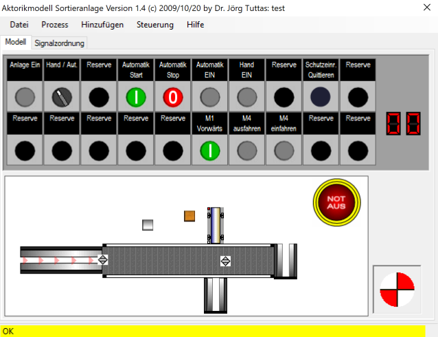
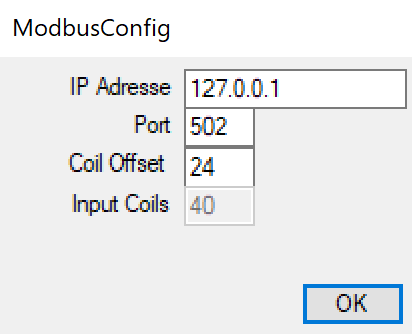
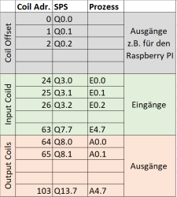

# Virtueller Prozess Sortieranlage
Eine virtuelle Sortieranlage, die via Modbus an eine Steuerung gekoppelt werden kann. Die einzelnen Bedienelemente (Leuchtmelder, Taster, Schalter etc.) und Prozesselemente (Ventile, induktive und kapazitive Näherungsschalter) sind dabei frei konfigurierbar und können als Datei gespeichert werden. Der Prozess orientiert sich dabei an den praktischen IHK Abschlussprüfungen f. den Elektroniker für Automatisierungstechnik. 

## Download
Die Anwendung kann als DotNet Anwendung **[hier](https://service.joerg-tuttas.de/IHKBand/publish.htm)** geladen werden.

## Signalzuordnung
Die Ein- und Ausgangssignale werden über Modbus Coils der Steuerung zugeordnet. Das Mapping kann über den Konfigurationsdialog eingestellt werden.

- IPAdresse ist die IP Adresse der Steuerung
- Port die Portnummer (default 502)
- Coil Offset, wird zum ersten Eingangssignal hinzu addiert (default 24)
- Anzahl der Eingänge. Entspricht auch die Anzahl der Ausgänge. Default ist 40.

 

## Video

